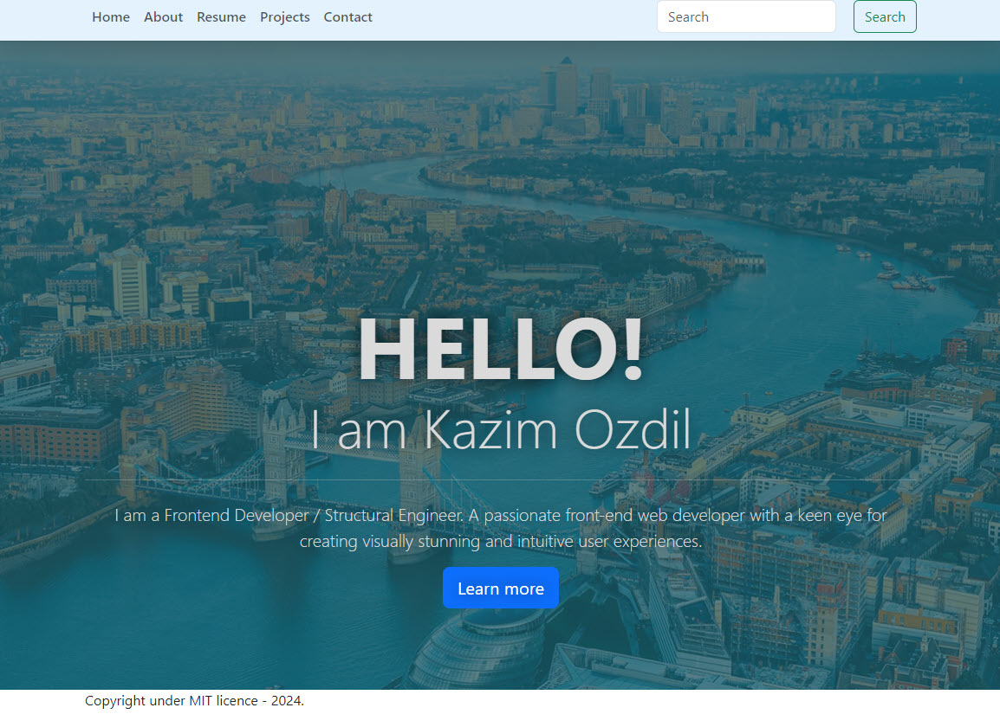

# React Portfolio Page
A portfolio page created by using Vite + React, Bootstrap with URL Routing

## Table of Contents
* [Installation](#installation)
* [Usage](#usage)
* [License](#license)
* [Contributing](#contributing)
* [Tests](#tests)
* [Questions](#questions)

## Installation
After cloning the package run 'npm install' to get required library.
## Usage
Change the resume.jsx as desired and check by running 'npm run dev' before deploy it.
## License
MIT License
## Contributing
Many thanks to Jung to get rid of me from legacy codes.
## Tests
No test instructions.
## Questions
If you have further questions, please click on my [Github Profile](https://www.github.com/ozdilkazim) or contact me at [skozdil@gmail.com](skozdil@gmail.com)